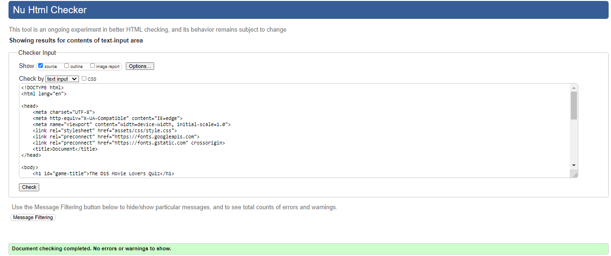
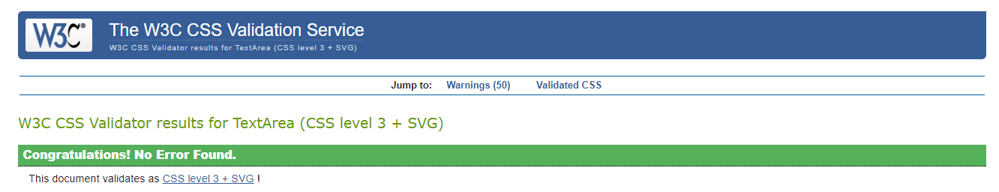
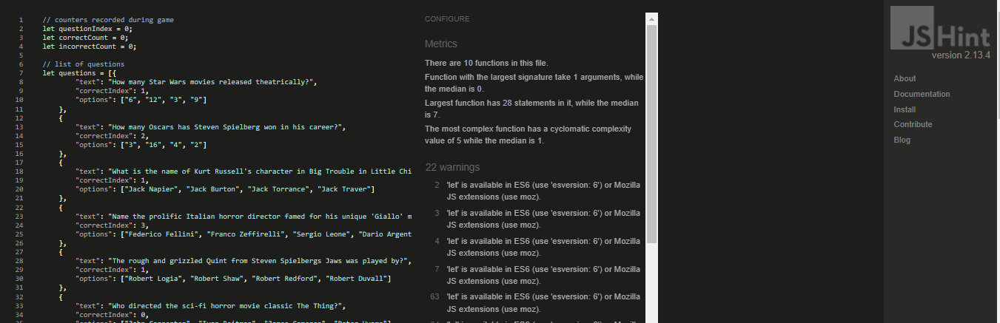
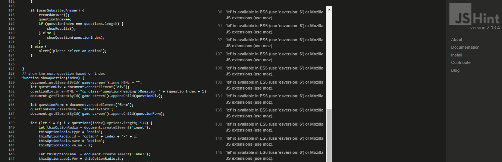

# D15 Movie Lovers Quiz
This is the companion quiz site to the D15 Movie Lovers Club. View the live project here: 

# User Experience UX
- ## User Stories
- ### <u>First Time Visitor Goals</u>
* As a first time visitor I want to see a simple, uncluttered easy to use quiz game.
* I want the questions easy to read and clear how to select and submit the answer.
* I want to see my question scores and to know when the quiz has ended.

- ### <u>Returning Visitor Goals</u>
* As a returning visitor I may want to join the club and I want to see that line of navigation clearly displayed.
* The links to the clubs main page should be clear and open in a new tab should I want to continue with the quiz later.

- ### <u>Frequent User Goals</u>
* As a frequent user I want to see questions updated very regularly and have the quiz expanded to include more aspects of the club (include special quizes related to recent screenings with the club)

# Design
- ### <u>Colour Scheme</u> 
* The main page background colour is #2e2931 and the game title a lighter #B4BFB0
* The game screen div was coloured #246858 with a border colour of standard red.
* The buttons were coloured differently with a view to make them prominent against the background colours but also with an aim to make them seem part of the overall scheme. The idea of the colour scheme was to create the dimly lit greens and greys usually associated with a trip to an old cinema.
* The colour schemes were selected with the help of colormind.io and mycolor.space.

- ### <u>Typography</u> 
* Sans-serif and Arial are used throughout the site to keep in style with the D15 Movie Lovers Club (the hypothetical club created for my first portfolio project).

- ### <u>Imagery</u>
* No images were used in this site. However it is my plan to add image-based questions at a later date.

- ### <u>Wireframes</u>
- All Devices
    
- Desktop
    
- Tablet
   

- Mobile
   

- ### <u>Features</u>
* The quiz is displayed dynamically. The user experiences "page navigation" however in reality I am simply setting the style.visibility attribute of Divs to simulate page navigation.
* A variable number of questions contained in an array are used to drive the page.
* User input validation is achieved via event listeners.
* Naturally responsive design for a range of devices from Phones to tablets to desktops. The site is naturally responsive and didn't require media queries to force responsive design to different screen sizes.
* Nav buttons and link contain a Hover attribute.
* join us button changes colour when the cursor hovers. 

# Technologies used
* HTML
* CSS
* Hover
* Git Pod
* Git Hub
* Balsamiq
* ami.responsivedesign.is
* JSHint
* CSS Jigsaw validator
* HTML W3 Validator

- ### <u>Testing</u>
* HTML validation 
 
* CSS validation

* JavaScript validation - noted warning regarding using esversion 6 but which does not affect execution.

	

# <u>Testing User Stories</u>
## First Time Visitor
* User is presented with the Start Quiz and Rules buttons clearly. Also the link to the club main page is clearly visible.
* Once the game starts teh questions, answers and submit button are neatly contained in a game screen clearly identifiable.
* Correct scores and Incorrect scores are also clealry displayed

# Returning Visitor
* Navigation links are clear and feature a hover display to help with users if they want to visit the clubs main page.
* The button to the clubs sign up page is also prominent and featurs a hover display. It links to the clubs sign up page in a separate tab.

# Frequent Visitor
* The questions should be updated regularly to service the club members as well as potential new members.

# Further Testing
* The site was tested on all contemporary browsers including Google Chrome, Microsoft Edge and Safari browsers.
* The website was viewed on a variety of devices such as desktop, laptop, iOS and Android devices.
* Complete site navigation testing was done.

# Deployment
### GitHub Pages

The project was deployed to GitHub Pages using the following steps...

1. Log in to GitHub and locate the [GitHub Repository](https://github.com/OdoJoe/The-D15-Movie-Lovers-Quiz)
2. At the top of the Repository (not top of page), locate the "Settings" Button on the menu.
3. Scroll down the Settings page until you locate the "GitHub Pages" Section.
4. Under "Source", click the dropdown called "None" and select "Master Branch".
5. The page will automatically refresh.
6. Scroll back down through the page to locate the now published site [link](placeholder) in the "GitHub Pages" section.

### Forking the GitHub Repository

By forking the GitHub Repository we make a copy of the original repository on our GitHub account to view and/or make changes without affecting the original repository by using the following steps...

1. Log in to GitHub and locate the [GitHub Repository](https://github.com/OdoJoe/The-D15-Movie-Lovers-Quiz)
2. At the top of the Repository (not top of page) just above the "Settings" Button on the menu, locate the "Fork" Button.
3. You should now have a copy of the original repository in your GitHub account.

### Making a Local Clone

1. Log in to GitHub and locate the [GitHub Repository](https://github.com/OdoJoe/The-D15-Movie-Lovers-Quiz)
2. Under the repository name, click "Clone or download".
3. To clone the repository using HTTPS, under "Clone with HTTPS", copy the link.
4. Open Git Bash
5. Change the current working directory to the location where you want the cloned directory to be made.
6. Type `git clone`, and then paste the URL you copied in Step 3.

# Credits

### Code
* mycolor.space - Helped with the colour scheme
* CSS Button Generator - generated all buttons used on the site
* educative.io - helped with Javascript code
* W3 Docs - helped with javascript code
* W3 Schools - helped with HTML, CSS and Javascript code
* StackOverflow - Helped with solving coding problems
* Code Institute Course Content, primarily the Javascript module including teh Love Maths walkthrough project
* Quiz and page built using HTML, CSS and Javascript
* Code is naturally responsive without the need for media queries

# Content
* All content created by developer, except the button styling which was imported from CSS Button Generator
* All questions are original and written by developer

# Acknowledgements
* Thanks to my mentor for helpful feedback and recommendations.
* Tutor support at Code Institute.

